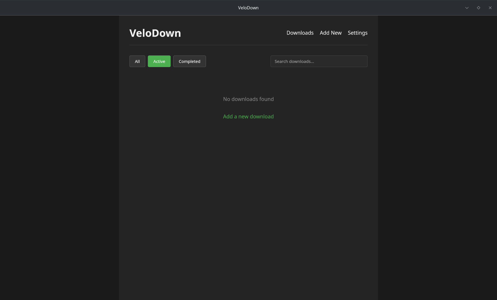
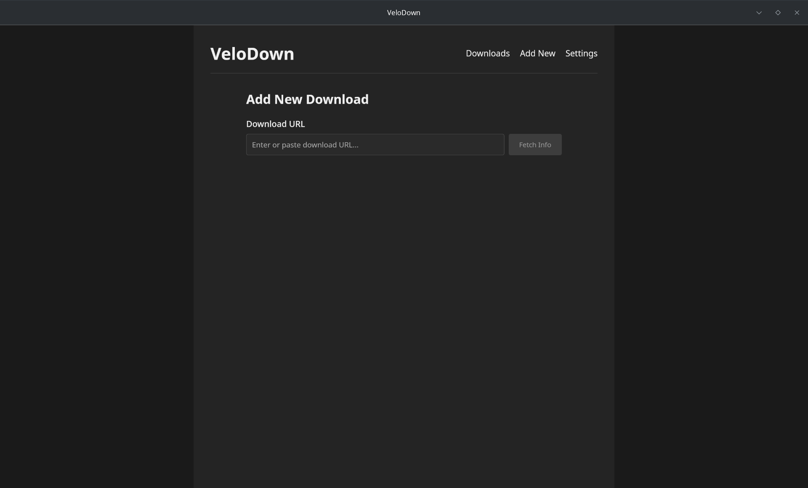
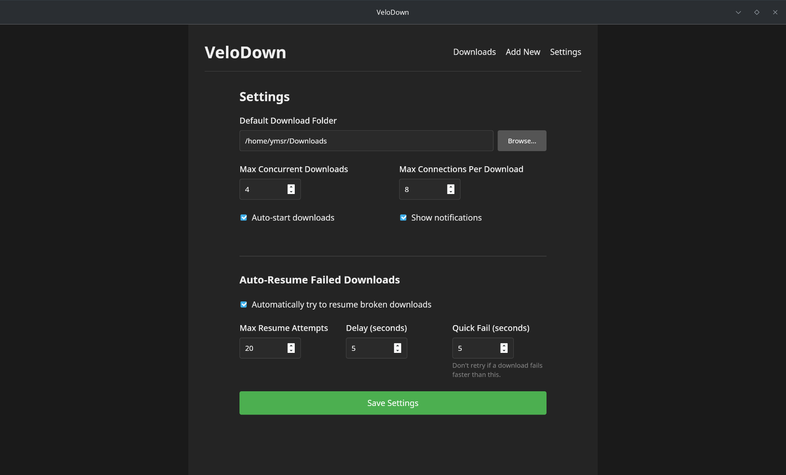

# VeloDown 

A minimal download manager built with Rust and Svelte, powered by Tauri v2.


## Features

- 🚀 **High-Performance Downloads** - Multi-threaded downloads with configurable connections per file
- ⏸️ **Pause & Resume** - Full support for pausing and resuming downloads
- 🔄 **Auto-Resume** - Automatically retry failed downloads with configurable attempts
- 📊 **Real-time Progress** - Live speed, progress, and time remaining indicators
- 🎯 **Smart File Detection** - Automatically detects filename and file type from URLs
- 📁 **Flexible Save Locations** - Choose custom save paths for each download
- 🔔 **Desktop Notifications** - Get notified when downloads complete
- 🌙 **Dark Theme** - Easy on the eyes with a modern dark interface
- 🖱️ **System Tray Integration** - Minimize to system tray for background operation

## Screenshots


*Download list with active transfers*


*Adding a new download*


*Configuration options*

## Installation

### Pre-built Binaries

Download the latest release for your platform from the [Releases](https://github.com/mlm-games/velodown/releases) page:

- **Windows**: `velodown_x.x.x_x64.exe` or `.msi` installer
- **macOS**: `velodown_x.x.x_x64.dmg`
- **Linux**: `velodown_x.x.x_amd64.AppImage` or `.deb` package

### Package Managers

#### AUR (Arch Linux)

```bash
yay -S velodown-bin
# or
paru -S velodown-bin
```

#### Snap (Coming Soon)

```bash
sudo snap install velodown
```

#### Chocolatey (Coming Soon)

```powershell
choco install velodown
```

#### Scoop (Coming Soon)

```powershell
scoop install velodown
```

## Building from Source

### Prerequisites

- [Node.js](https://nodejs.org/) (LTS version)
- [Rust](https://www.rust-lang.org/tools/install) (latest stable)
- Platform-specific dependencies:

#### Linux
```bash
sudo apt update
sudo apt install libwebkit2gtk-4.1-dev \
    build-essential \
    curl \
    wget \
    file \
    libxdo-dev \
    libssl-dev \
    libayatana-appindicator3-dev \
    librsvg2-dev
```

#### macOS
```bash
# Install Xcode Command Line Tools
xcode-select --install
```

#### Windows
- Microsoft C++ Build Tools or Visual Studio 2022

### Build Steps

1. Clone the repository:
```bash
git clone https://github.com/mlm-games/velodown.git
cd velodown
```

2. Install dependencies:
```bash
npm install
```

3. Build the application:
```bash
npm run tauri build
```

The built binaries will be available in `src-tauri/target/release/bundle/`

## Usage

### Adding Downloads

1. Click "Add New" in the navigation
2. Paste or type a download URL
3. The app will automatically fetch file information
4. Optionally choose a custom save location
5. Click "Start Download"

### Managing Downloads

- **Pause**: Click the pause button (⏸️) on an active download
- **Resume**: Click the play button (▶️) on a paused download
- **Cancel**: Click the cancel button (❌) to stop and remove a download
- **Open File**: Click the file button (📄) to open a completed download
- **Open Folder**: Click the folder button (📁) to open the download location

### Settings

Configure VeloDown's behavior in the Settings page:

- **Default Download Folder**: Where files are saved by default
- **Max Concurrent Downloads**: Number of simultaneous downloads (1-10)
- **Max Connections Per Download**: Split downloads into multiple connections (1-16)
- **Auto-start Downloads**: Begin downloads immediately when added
- **Show Notifications**: Desktop notifications for completed downloads
- **Auto-Resume Failed Downloads**: Automatically retry failed downloads
  - Max Resume Attempts: How many times to retry (1-20)
  - Retry Delay: Seconds to wait between attempts
  - Quick Fail Duration: Don't retry if download fails faster than this

## Development

### Running in Development Mode

```bash
# Start the development server
npm run tauri dev
```

### Project Structure

```
velodown/
├── src/                    # Frontend (Svelte)
│   ├── lib/               # Svelte components
│   ├── routes/            # SvelteKit routes
│   └── app.css           # Global styles
├── src-tauri/             # Backend (Rust)
│   ├── src/              # Rust source code
│   ├── icons/            # App icons
│   └── Cargo.toml        # Rust dependencies
└── package.json          # Node dependencies
```

### Key Technologies

- **Frontend**: SvelteKit, TypeScript, Vite
- **Backend**: Rust, Tauri v2, Tokio
- **Downloads**: reqwest with streaming support
- **Storage**: JSON file-based persistence

## Contributing

Contributions are welcome! Please feel free to submit a Pull Request.

1. Fork the repository
2. Create your feature branch (`git checkout -b feature/AmazingFeature`)
3. Commit your changes (`git commit -m 'Add some AmazingFeature'`)
4. Push to the branch (`git push origin feature/AmazingFeature`)
5. Open a Pull Request

## License

This project's license can be viewed in [LICENSE](LICENSE) file for details.

## Acknowledgments

- Built with [Tauri](https://tauri.app/) - Build smaller, faster, and more secure desktop applications
- UI powered by [SvelteKit](https://kit.svelte.dev/) - The fastest way to build Svelte apps
- Icons from [Tauri Icons](https://tauri.app/v1/guides/features/icons/)

## Support

- 🐛 **Bug Reports**: [GitHub Issues](https://github.com/mlm-games/velodown/issues)
- 💬 **Discussions**: [GitHub Discussions](https://github.com/mlm-games/velodown/discussions)
